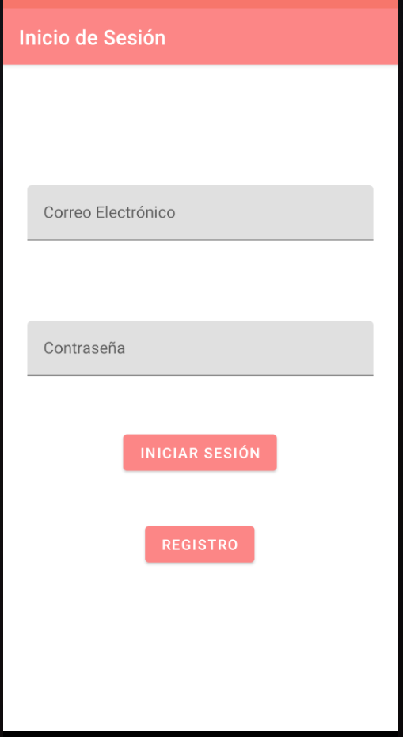
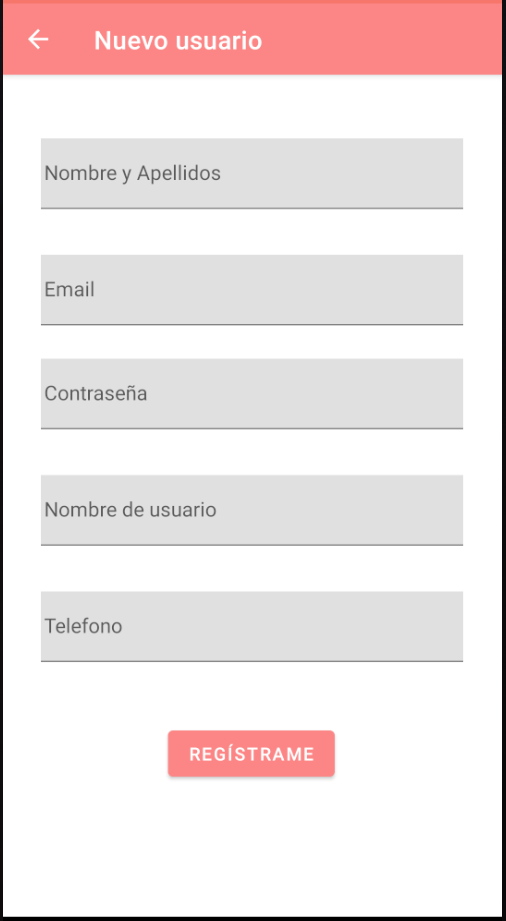
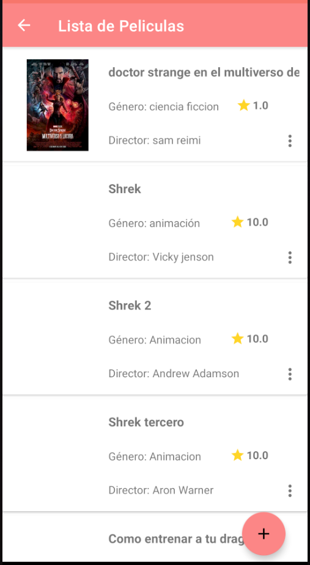
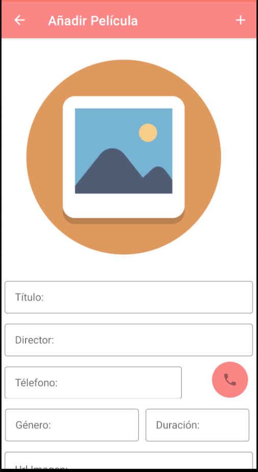

## App películas

**Pantallas app:**

1. Inicio de sesión
2. Registro de usuario
3. Lista películas
4. Detalles películas

**1.Inicio de sesión:**

**2.Registro de usuario:**

**3.Lista de peliculas:**

**4.Añadir/Editar peliculas:**

# Funcionamiento de la app:

La app comienza en una pantalla de inicio donde puedes iniciar sesión y entrar a la lista o pasar al registro y crear un nuevo usuario,
dentro de la lista se puede agregar una nueva película, borra películas o entrar en la pantalla de detalles, donde puedes editar los datos
de la misma.
